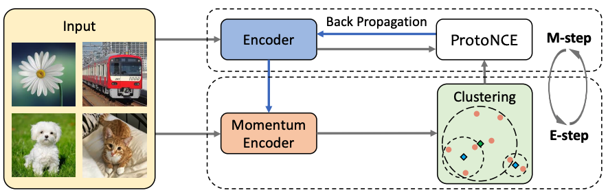

## Prototypical Contrastive Learning of Unsupervised Representations (Salesforce Research)

This is a PyTorch implementation of the <a href="https://openreview.net/forum?id=KmykpuSrjcq">PCL paper</a>:
<pre>
@inproceedings{PCL,
	title={Prototypical Contrastive Learning of Unsupervised Representations},
	author={Junnan Li and Pan Zhou and Caiming Xiong and Steven C.H. Hoi},
	booktitle={ICLR},
	year={2021}
}</pre>

### Requirements:
* ImageNet dataset
* Python ≥ 3.6
* PyTorch ≥ 1.4
* <a href="https://github.com/facebookresearch/faiss">faiss-gpu</a>: pip install faiss-gpu
* pip install tqdm

### Unsupervised Training:
This implementation only supports multi-gpu, DistributedDataParallel training, which is faster and simpler; single-gpu or DataParallel training is not supported.

To perform unsupervised training of a ResNet-50 model on ImageNet using a 4-gpu or 8-gpu machine, run: 
<pre>python main_pcl.py \ 
  -a resnet50 \ 
  --lr 0.03 \
  --batch-size 256 \
  --temperature 0.2 \
  --mlp --aug-plus --cos (only activated for PCL v2) \	
  --dist-url 'tcp://localhost:10001' --multiprocessing-distributed --world-size 1 --rank 0 \
  --exp-dir experiment_pcl
  [Imagenet dataset folder]
</pre>

### Download Pre-trained Models
<a href="https://storage.googleapis.com/sfr-pcl-data-research/PCL_checkpoint/PCL_v1_epoch200.pth.tar">PCL v1</a>| <a href="https://storage.googleapis.com/sfr-pcl-data-research/PCL_checkpoint/PCL_v2_epoch200.pth.tar">PCL v2</a>
------ | ------

### Linear SVM Evaluation on VOC
To train a linear SVM classifier on VOC dataset, using frozen representations from a pre-trained model, run:
<pre>python eval_svm_voc.py --pretrained [your pretrained model] \
  -a resnet50 \ 
  --low-shot (only for low-shot evaluation, otherwise the entire dataset is used) \
  [VOC2007 dataset folder]
</pre>

Linear SVM classification result on VOC, using ResNet-50 pretrained with PCL for 200 epochs:

Model| k=1 | k=2 | k=4 | k=8 | k=16| Full
 --- | --- | --- | --- | --- | --- | ---
PCL v1| 46.9| 56.4| 62.8| 70.2| 74.3 | 82.3
PCL v2| 47.9| 59.6| 66.2| 74.5| 78.3 | 85.4

k is the number of training samples per class.

### Linear Classifier Evaluation on ImageNet
Requirement: pip install tensorboard_logger \
To train a logistic regression classifier on ImageNet, using frozen representations from a pre-trained model, run:
<pre>python eval_cls_imagenet.py --pretrained [your pretrained model] \
  -a resnet50 \ 
  --lr 5 \
  --batch-size 256 \
  --id ImageNet_linear \ 
  --dist-url 'tcp://localhost:10001' --multiprocessing-distributed --world-size 1 --rank 0 \
  [Imagenet dataset folder]
</pre>

Linear classification result on ImageNet, using ResNet-50 pretrained with PCL for 200 epochs:
PCL v1 | PCL v2
------ | ------
  61.5 |  67.6

